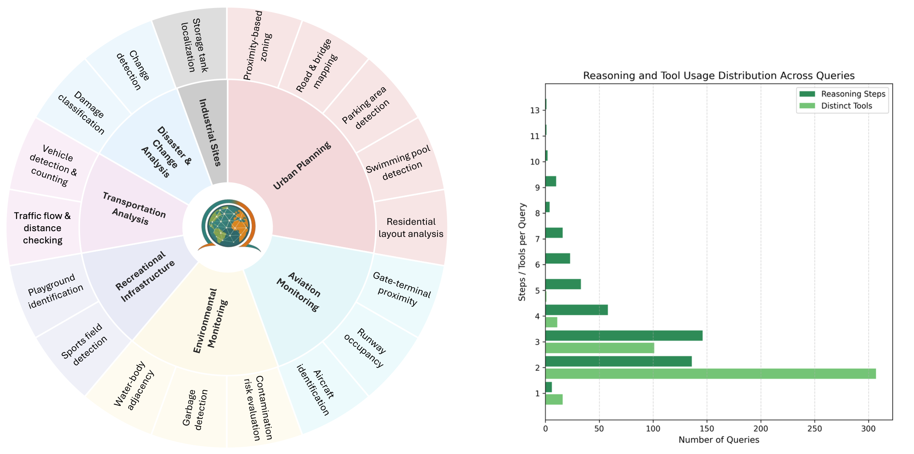
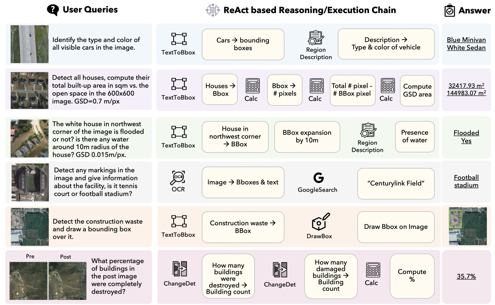

# ThinkGeo : Evaluating Tool-Augmented Agents for Remote Sensing Tasks


[Akashah Shabbir](https://github.com/AkashahS)\*, [Muhammad Akhtar Munir]()\*, [Akshay Dudhane]()\*, [Muhammad Umer Sheikh](), [Muhammad Haris Khan](), [Paolo Fraccaro](), [Juan Bernabe Moreno](), [Fahad Shahbaz Khan]() and [Salman Khan]()

**Mohamed bin Zayed University of Artificial Intelligence, Linköping University, Australian National University**

[](https://mbzuai-oryx.github.io/ThinkGeo/)
[](https://arxiv.org/abs)
[](https://huggingface.co/datasets/MBZUAI/ThinkGeo)
[](https://github.com/mbzuai-oryx/ThinkGeo/stargazers)
  [](https://github.com/mbzuai-oryx/ThinkGeo/blob/main/LICENSE)
  
---

## 📢  Latest Updates

- **May-29-2025**: 📂 ThinkGeo benchmark is released on **_HuggingFace_** [MBZUAI/ThinkGeo](https://huggingface.co/datasets/MBZUAI/ThinkGeo)
- **May-29-2025**: 📜 Technical Report of ThinkGeo paper is released [arxiv link](https://arxiv.org/abs).

## ThinkGeo Overview

ThinkGeo is a specialized benchmark designed to evaluate how language model agents handle complex remote sensing tasks through structured tool use and step-by-step reasoning. It features human-curated queries grounded in satellite and aerial imagery across diverse real-world domains such as disaster response, urban planning, and environmental monitoring. Using a ReAct-style interaction loop, ThinkGeo tests both open and closed-source LLMs on over 400 multi-step agentic tasks. The benchmark measures not only final answer correctness but also the accuracy and consistency of tool usage throughout the process. By focusing on spatially grounded, domain-specific challenges, ThinkGeo fills a critical gap left by general-purpose evaluation frameworks.



## Key Features

- A dataset comprising 436 remote sensing tasks, linked with medium to high-resolution earth observation imagery across domains like urban planning, disaster response, aviation, and environmental monitoring.

- A set of 14 executable tools simulates real-world RS workflows, including modules for perception, computation, logic, and visual annotation.

- Two evaluation modes—step-by-step and end-to-end—use with detailed metrics to assess instruction adherence, argument structure, reasoning steps, and final accuracy.

- Benchmarking advanced LLMs (GPT-4o, Claude-3, Qwen-2.5, LLaMA-3) reveals ongoing challenges in multimodal reasoning and tool integration.

## Dataset Examples

The following figure presents a set of representative samples from the ThinkGeo benchmark, a comprehensive evaluation framework for geospatial tasks. Each row in the table showcases a complete interaction flow, beginning with a user query that is grounded in remote sensing (RS) imagery. Following the user query, each example demonstrates a ReAct-based execution chain—an approach that integrates reasoning and action through a combination of tool calls and logical steps. These execution chains involve the dynamic selection and use of various tools, depending on the demands of the specific query.



The data samples span a wide range of application domains, underscoring the benchmark's diversity. These domains include transportation analysis, urban planning, disaster assessment and change analysis, recreational infrastructure, and environmental monitoring, highlighting multi-tool reasoning and spatial task complexity.

## Results

Evaluation results across models on the ThinkGeo benchmark are summarized in the table. The left side presents step-by-step execution metrics, while the right side reports end-to-end performance. Metrics include tool-type accuracy—categorized by Perception (P), Operation (O), and Logic (L)—as well as final answer accuracy (Ans.) and answer accuracy with image grounding (Ans_I).


---

## 📜 Citation 

```bibtex
@article{shabbir2025ThinkGeo,
  title={ThinkGeo: Evaluating Tool-Augmented Agents for Remote Sensing Tasks}, 
  author={Akashah Shabbir, Muhammad Akhtar Munir, Akshay Dudhane, Muhammad Umer Sheikh, Muhammad Haris Khan, Paolo Fraccaro, Juan Bernabe Moreno, Fahad Shahbaz Khan and Salman Khan},
  journal={ArXiv},
  year={2025},
  url={https://arxiv.org/abs}
}
```

---

[](https://www.ival-mbzuai.com)
[](https://github.com/mbzuai-oryx)
[](https://mbzuai.ac.ae)
